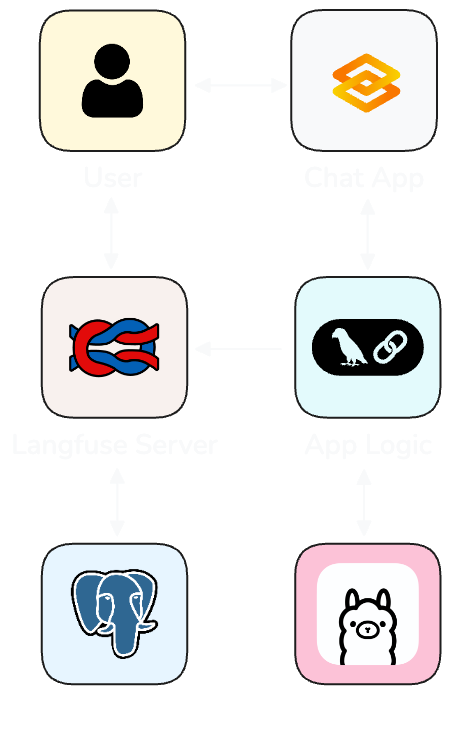
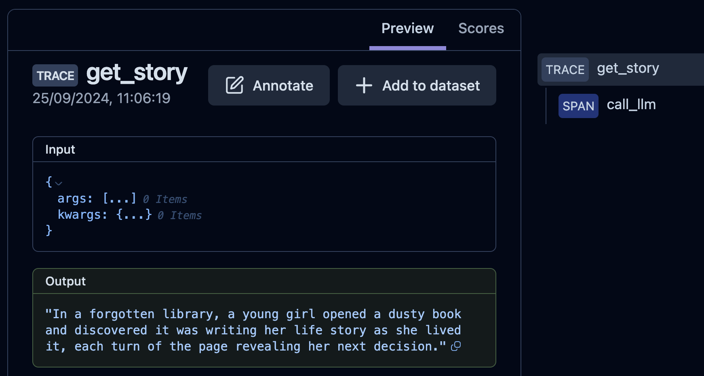

# Monitoring and Evaluating LLM Apps
> *Using Langfuse*

---

## About me

##### Hi there, I'm Ruan Pretorius 👋

- ☕ I turn coffee into AI
- 🖥 I am a data scientist at *[melio.ai](https://melio.ai/)*
  - We help you build and deploy your data intensive apps to unlock value from your data, follow us on LinkedIn
- 🔗 You can find me on GitHub *[@ruankie](https://github.com/ruankie)*
- ✉️ Or contact me via email: *ruan@melio.ai*

#


---

## 🚏 Outline

- **Introduction**: Why monitor/evaluate LLM apps?
- **Setup**: Local LLMs for prototyping
- **Monitoring**: with Langfuse
- **Evaluation**: LLM-assisted with Ollama and Langfuse
- **Takeaways and Conclusion**

---

## ❓ Why Monitor & Evaluate LLM Apps?

- **Ensure Quality & Performance**
  - Track hallucination, retrieval accuracy, latency, etc.
  - To maintain a high-quality user experience
- **Detect Errors**
  - Harmful outputs
- **Identify Areas of Improvement**
  - Reduce costs
  - Reduce latency
  - Improve answers
  - If failure occurs, see when and where

---

## 🏗️ What We'll Be Building



---

## ⚡ Setting Up

> Local LLMs for zero-cost learning and prototyping

### 🦙 Ollama

- For locally running LLMs
- Available for macOS, Linux, and Windows (preview)
- Familiar Docker feel with `:version` tags and commands like `pull` and `run`


---

## 🦙 Ollama Setup

- ⬇️ Download app from [`https://ollama.com/`](https://ollama.com/)
- Download LLM of choice

  ```bash
  ollama pull llama3.1:8b
  ```

- To test, run LLM in terminal

  ```bash
  ollama run llama3.1:8b
  ```


---

TODO: Show gif of Ollama running in terminal

---

## 📊 Monitoring LLM Apps with Langfuse

- **What is Langfuse?**
  - Open Source LLM engineering platform
  - For tracing, evaluation, prompt management, etc.
  - Can be used to debug and improve your LLM apps
  - Can use as service or self-host


---

## 🏗️ Setting Up Langfuse

> Option 1: Use as service

- Sign up at [`https://cloud.langfuse.com/`](https://cloud.langfuse.com/)
- Select region for hosting (`EU` or `US`)
- Create a new Project
- Generate API keys for sending traces


---

## 🏗️ Setting Up Langfuse

> Option 2: Locally, with Docker compose

- Requires `docker` and `docker compose` - get with [Docker Desktop](https://docs.docker.com/get-started/get-docker/)
- Run Docker compose to spin up local Langfuse

  ```bash
  # Clone the Langfuse repository
  git clone https://github.com/langfuse/langfuse.git
  cd langfuse
  
  # Start the server and database
  docker compose up
  ```

---

## 🏗️ Setting Up Langfuse

> Before using in code

- Finally, pip-install the `langfuse` package

  ```bash
  pip install langfuse
  ```

- And set these environment variables to communicate with your Langfuse instance

  ```bash
  export LANGFUSE_SECRET_KEY="sk-..."
  export LANGFUSE_PUBLIC_KEY="pk-..."
  export LANGFUSE_HOST="https://cloud.langfuse.com" # or local instance
  ```

---

## ✅ Done Setting Up Langfuse

- Now we have our infrastructure set up
  - Langfuse server with web UI (at `localhost:3000`)
  - Postgres DB as backend (at `localhost:5432`)
- The Python package needed to communicate with it
- And we've pointed it to our instance

---

TODO: Show gif of Langfuse dashboard

---

## 🎯 Monitoring with Langfuse

> Instrumenting your code

- Configure your app to talk to your Langfuse instance
  - Configure Langfuse to send traces to correct instance
  - Python decorator
  - LangChain callback handler

---

## 📡 Langfuse Instrumentation

> Python decorator (for any Python function)

```python
from langfuse.decorators import observe

@observe()
def call_llm(prompt: str):
    # Any code
    response: str = llm.invoke(prompt)
    return response
 
@observe()
def get_story():
    story = call_llm("Tell me a story")
    return story

get_story()
```

---

## 🪢 Langfuse Trace

> Traces, spans, nesting...



---

TODO: Show Langfuse trace of this code
> And explain concepts of Traces, Spans, etc.
> See the [docs](https://langfuse.com/docs/tracing#introduction-to-observability--traces-in-langfuse)

---

TODO: (At end of langfuse section) List reasons to use Langfuse and some of its main features, also mention alternatives (Langserve, Phoenix)
> See [docs](https://langfuse.com/docs/tracing#why-use-langfuse) for list

---


## 📊 LLM-Assisted Evaluation with Langfuse

- **Evaluation Datasets** 📚
  - How Langfuse helps score and evaluate your LLM outputs
- **LLM-Assisted Scoring** 🎯
  - Automated evaluation using predefined metrics
  - Feedback loop to improve LLM performance
---

## 📈 Best Practices for Monitoring and Evaluation

- **Key Takeaways** 💡
  - Prototyping fast and free with local LLMs 🖥️
  - Monitoring with Langfuse to ensure app robustness 📊
  - LLM-assisted evaluation for continuous improvement 🔁
---

## 🎉 Conclusion: Elevate Your LLM Workflow

- **Summary** of key points:
  - Local LLM setup with Ollama 🚀
  - Langfuse for monitoring and evaluation 🧰
  - Automating scoring and feedback 📝
- **Final Thoughts**: Start small, scale smart! 🌟
---

#

## <!--fit--> 🐍 Thank you!

#

- 🔗 GitHub: *[@ruankie](https://github.com/ruankie)*
- ✉️ Email: *ruan@melio.ai*
- 🏠 Melio website: *[melio.ai](https://melio.ai)*

  