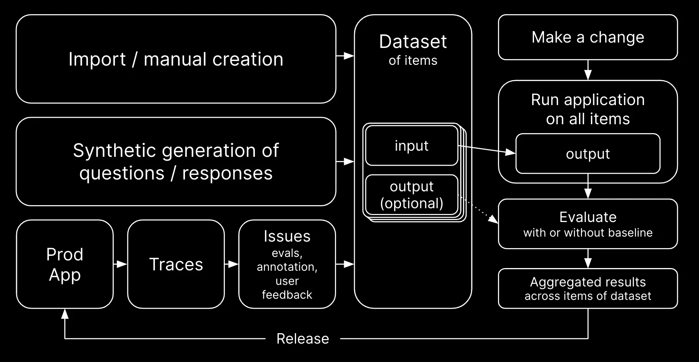

# Monitoring and Evaluating LLM Apps
> *Using Langfuse*

---

## About me

##### Hi there, I'm Ruan Pretorius 👋

- ☕ I turn coffee into AI
- 🖥 I am a data scientist at *[melio.ai](https://melio.ai/)*
  - We help you build and deploy your data intensive apps to unlock value from your data, follow us on LinkedIn
- 🔗 You can find me on GitHub *[@ruankie](https://github.com/ruankie)*
- ✉️ Or contact me via email: *ruan@melio.ai*

#


---

## 🚏 Outline

- **Introduction**: Why monitor/evaluate LLM apps?
- **Setup**: Local LLMs for prototyping
- **Monitoring**: with Langfuse
- **Evaluation**: LLM-assisted with Ollama and Langfuse
- **Takeaways and Conclusion**

---

## ❓ Why Monitor & Evaluate LLM Apps?

- **Ensure Quality & Performance**
  - Track hallucination, retrieval accuracy, latency, etc.
  - To maintain a high-quality user experience
- **Detect Errors**
  - Harmful outputs
- **Identify Areas of Improvement**
  - Reduce costs
  - Reduce latency
  - Improve answers
  - If failure occurs, see when and where

---

## 🏗️ What We'll Be Building


---

## ⚡ Setting Up

> Local LLMs for zero-cost learning and prototyping

### 🦙 Ollama

- For locally running LLMs
- Available for macOS, Linux, and Windows (preview)
- Familiar Docker feel with `:version` tags and commands like `pull` and `run`


---

## 🦙 Ollama Setup

- ⬇️ Download app from [`https://ollama.com/`](https://ollama.com/)
- Download LLM of choice

  ```bash
  ollama pull llama3.1:8b
  ```

- To test, run LLM in terminal

  ```bash
  ollama run llama3.1:8b
  ```


---

## 🦙 Testing Ollama in a Terminal


---

## 📊 Monitoring LLM Apps with Langfuse

- **What is Langfuse?**
  - Open Source LLM engineering platform
  - For tracing, evaluation, prompt management, etc.
  - Can be used to debug and improve your LLM apps
  - Can use as service or self-host


---

## 🏗️ Setting Up Langfuse

> Option 1: Use as service

- Sign up at [`https://cloud.langfuse.com/`](https://cloud.langfuse.com/)
- Select region for hosting (`EU` or `US`)
- Create a new Project
- Generate API keys for sending traces


---

## 🏗️ Setting Up Langfuse

> Option 2: Locally, with Docker compose

- Requires `docker` and `docker compose` - get with [Docker Desktop](https://docs.docker.com/get-started/get-docker/)
- Run Docker compose to spin up local Langfuse

  ```bash
  # Clone the Langfuse repository
  git clone https://github.com/langfuse/langfuse.git
  cd langfuse
  
  # Start the server and database
  docker compose up
  ```

---

## 🏗️ Setting Up Langfuse

> Before using in code

- Finally, pip-install the `langfuse` package

  ```bash
  pip install langfuse
  ```

- And set these environment variables to communicate with your Langfuse instance

  ```bash
  export LANGFUSE_SECRET_KEY="sk-..."
  export LANGFUSE_PUBLIC_KEY="pk-..."
  export LANGFUSE_HOST="https://cloud.langfuse.com" # or local instance
  ```

---

## ✅ Done Setting Up Langfuse

- Now we have our infrastructure set up
  - Langfuse server with web UI (at `localhost:3000`)
  - Postgres DB as backend (at `localhost:5432`)
- The Python package needed to communicate with it
- And we've pointed it to our instance

---

### 🪢 The Langfuse Dashboard


---

## 🎯 Monitoring with Langfuse

> Instrumenting your code

- Configure your app to talk to your Langfuse instance
  - Configure Langfuse to send traces to correct instance
  - Python decorator
  - LangChain callback handler

---

## 📡 Langfuse Instrumentation

> Python decorator (for any Python function)

```python
from langfuse.decorators import observe

@observe()
def call_llm(prompt: str):
    # Any code
    response: str = llm.invoke(prompt)
    return response
 
@observe()
def get_story():
    story = call_llm("Tell me a story")
    return story

get_story()
```

---

## 🪢 Langfuse Trace

> Traces, spans, nesting...


---

## 📡 Langfuse Instrumentation

> LangChain callback handler (for automatic LangChain integration)

```python
from langfuse.callback import CallbackHandler

langfuse_handler = CallbackHandler()

# Any LangChain Runnable (e.g. RAG chain)
rag_chain.invoke(
    "Explain how the different types of agent memory work",
    config={"callbacks": [langfuse_handler]}
)
```

---

## 🪢 Langfuse Trace

> Automatically labelled Traces/Spans


---

TODO: Show Langfuse trace of this code
> And explain concepts of Traces, Spans, etc.
> See the [docs](https://langfuse.com/docs/tracing#introduction-to-observability--traces-in-langfuse)

---

TODO: (At end of langfuse section) List reasons to use Langfuse and some of its main features, also mention alternatives (Langserve, Phoenix)
> See [docs](https://langfuse.com/docs/tracing#why-use-langfuse) for list

---

## 📊 LLM-Assisted Evaluation with Langfuse

- **Evaluation Datasets** 📚
  - To capture a set of inputs and expected outputs for your system
  - To log runs of your system versions on the data
  - For tracking performance over time or testing before pushing to prod
- **LLM-Assisted Scoring** 🎯
  - Attach a score to a trace (human or programmatic evaluation)
  - Automated evaluation using predefined metrics
  - Use as feedback loop to improve your system's performance

---

## 🔁 Langfuse Eval Flow



> From https://langfuse.com/docs/datasets/overview

---

## 🪢 Langfuse Dataset

- First, create a Langfuse client with the Python SDK

  ```python
  from langfuse import Langfuse
  langfuse = Langfuse()
  ```

- Then, create a dataset with a name

  ```python
  langfuse.create_dataset(name="eval-dataset-v1")
  ```

---

## 🪢 Langfuse Dataset

- Finally, populate the dataset with input-output pairs

  ```python
  dataset = {
    "question1": "answer1",
    ...
  }

  for question, expected_ans in dataset.items():
    langfuse.create_dataset_item(
      dataset_name="eval-dataset-v1",
      input=question,
      expected_output=expected_ans,
    )
  ```

---

## 🪢 Langfuse Dataset


---

## 🪢 Langfuse Dataset Runs

- Now you can pull the dataset

  ```python
  dataset = langfuse.get_dataset("eval-dataset-v1")
  ```

- And loop through items in the dataset for passing to your app

---

## 🪢 Add Loop Through Dataset and Eval Responses

  ```python
  for item in dataset.items:
    # Invoke app
    output, lf_trace_id = invoke_agent(question=item.input)

    # Link trace to dataset run
    item.link(
      run_name="Eval agent v0.0.1",
      run_metadata={...},
      trace_id=lf_trace_id,
    )

    # Eval
    c = get_correctness(output, item.expected_output)

    # Add score
    langfuse.score(
      trace_id=lf_trace_id,
      name="Answer Correctness,
      value=c
    )
  ```

---

## 🪢 Langfuse Trace Annotation

- As seen, you can attach values/scores to Traces
  - Using Python SDK (programmatic eval with `langfuse.score()`)
  - Or in the Dashboard (human eval, with `Annotations` button)
- These scores are aggregated per Dataset Run and shown in the Dashboard

---

## 🪢 Langfuse Trace Annotation

> Very useful to compare performance of your app versions


---

## 🪢 Langfuse Conclusion

- This was just a quick overview of Langfuse
  - It also has other features, like prompt management
  - New updates released often
- Some Langfuse alternatives
  - Arize Phoenix
  - LangSmith (from LangChain)

---

## 📈 Best Practices for Monitoring and Evaluation

- **Key Takeaways** 💡
  - Prototyping fast and free with local LLMs 🖥️
  - Monitoring with Langfuse to ensure app robustness 📊
  - LLM-assisted evaluation for continuous improvement 🔁

---

## 🎉 Conclusion: Elevate Your LLM Workflow

- **Summary** of key points:
  - Local LLM setup with Ollama 🚀
  - Langfuse for monitoring and evaluation 🧰
  - Automating scoring and feedback 📝
- **Final Thoughts**: Start small, scale smart! 🌟

---

#

## <!--fit--> 🐍 Thank you!

#

- 🔗 GitHub: *[@ruankie](https://github.com/ruankie)*
- ✉️ Email: *ruan@melio.ai*
- 🏠 Melio website: *[melio.ai](https://melio.ai)*

  